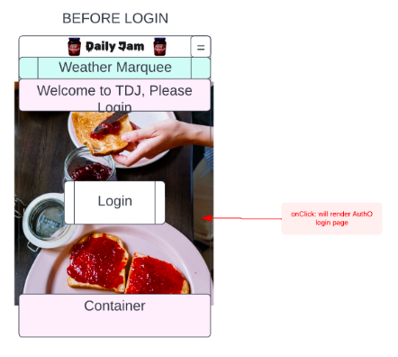
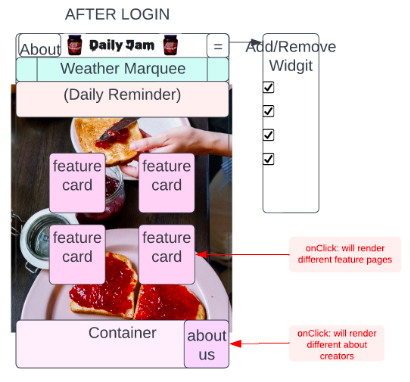
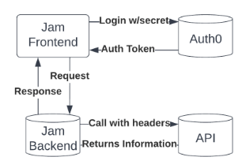

# Daily Jam Application Backend Server

## What is the vision of this product?

* Our vision for Daily Jam is a mobile-first and multi-purpose application with different features loosely based around JAM puns. These will include entertaining and useful functionality using APIs.

### Creators

1. James Brooks
2. Michael Maker
3. Christopher Yamas
4. Tai Egashira

### What pain point does this project solve?

* Trying to solve boredom and lack of jam-based content in people’s lives. People should have an amusing hub to also get useful information. Allow users to find news, weather, food recipes, up-to-hour traffic info, and more in an enjoyable, jam-themed (purple-ish color theme/palette), intuitive format.

### Why should we care about your product?

* In an over-stimulating world demanding our attention is spread too thin, Daily Jam app will stimulate the users mental taste-buds and leave them satisfied.

Page before user login/auth:

Page after user login/auth:

WRRC:

